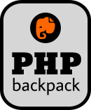

# [PHP backpack](https://github.com/raimundo-matias/php-backpack#readme.md)

> A *local development environment* for **PHP** applications **"the right way"**

## Project overview

This project provides a *local PHP development environment based on docker*, containing the following technologies:

✓ Apache 2.4\
✗ PHP-FPM 7.4\
✗ PHP Composer\
✗ XDebug\
✗ PostgreSQL 9.4

In addition to the technologies described, this project also provides the creation of domain name for local use (ServerName) and self-signed certificate **in an automated way**, and **enabled by default on the web server**.

## Project structure after create ssl certificate

```bash
.
├── app
│   └── # MAKE YOUR APPLICATION HERE
├── conf
│   └── apache
│       ├── server.crt
│       ├── server.key
│       ├── rootCA.crt # IMPORT THIS FILE IN YOUR BROWSER
│       └── Dockerfile
├── docker-compose.yml
├── .env-example
├── .gitignore
└── README.md
```

## How to use this project

1. Clone this project ;)

    ```bash
    git clone https://github.com/user/raimundo-matias/php-backpack
    ```

2. Create the environment configuration file

    ```bash
    cd php-backpack && cp env-example .env
    ```

3. Change the value of the `SSL_DOMAIN` variable in the `.env` file as desired, and add this name to your operating system's hosts file

4. Run the certificate creation file

    ```bash
    source conf/apache/create-certs.sh
    ```

5. After the script is finished, import the `conf / apache / rootCA.crt` file into your browser

     Firefox

    `Menu` ➔ `Preferences` ➔ `Privacy and Security` ➔ `View Certificates` ➔ `tab: Authorities` ➔ `button: Import`

     Chrome

    `Menu` ➔ `Settings` ➔ `Privacy and security` ➔ `Manage certificates (in the more session)` ➔ `tab: Authorities` ➔ `button: Import`

6. Run the docker-compose and be happy!

    ```bash
    docker-compose up --build
    ```

## Credits

I thank all the people in the technology community who shared their efforts and knowledge so that I could do this job!

In particular, I am grateful for the following references:

1. [base concept's and initial's reference for SSL](https://gist.github.com/fntlnz/cf14feb5a46b2eda428e000157447309)
2. [ssl automation](https://gist.github.com/fntlnz/cf14feb5a46b2eda428e000157447309)
3. [httpd container with SSL concept](https://github.com/InAnimaTe/docker-httpd-ssl)
4. [php-fpm container with PHP Composer and XDebug](https://github.com/GaetanRole/php-docker-starter)
